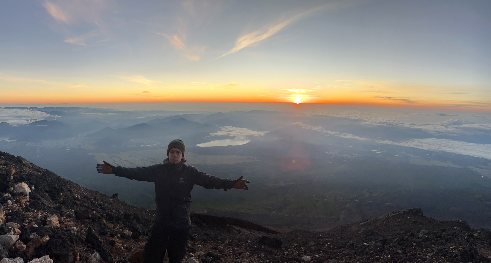
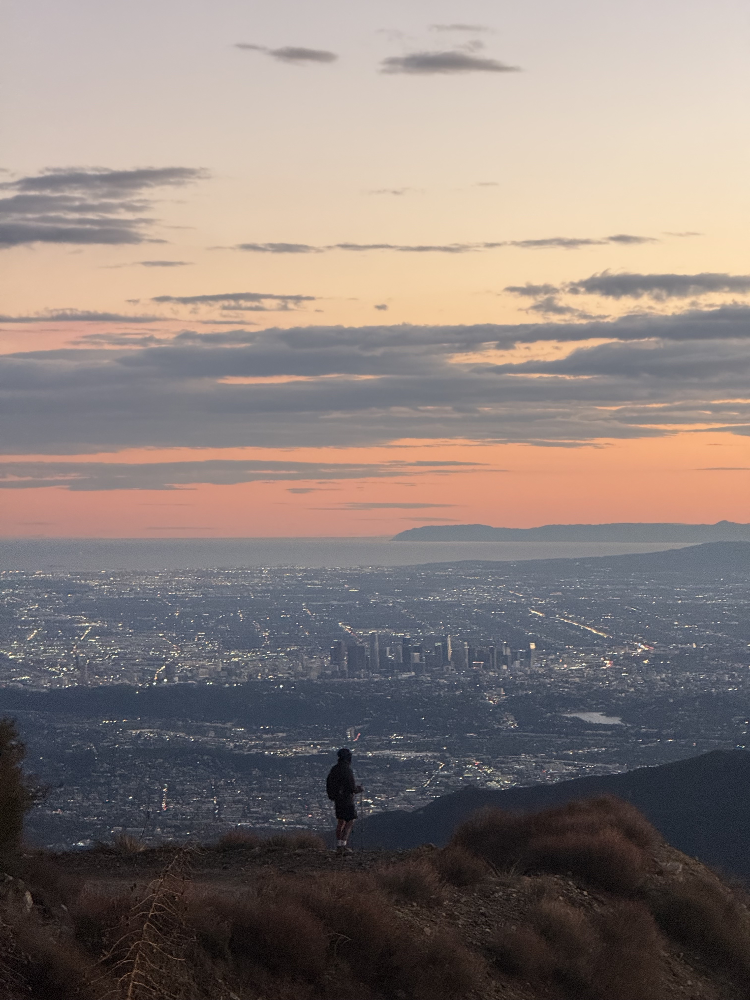
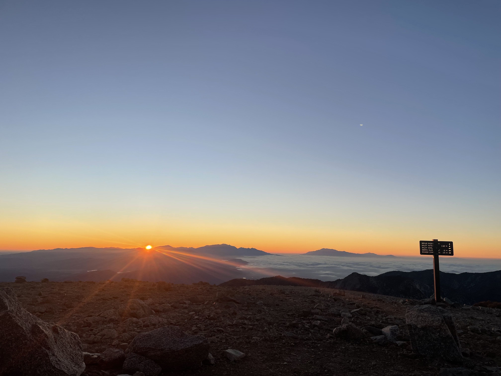

::: {style="text-align: left;"}
Outside of mathematics, I am an avid hiker. I'm constantly seeking new trails to explore around Los Angeles and beyond.

Below are a few pictures!

# Hiking

::: {layout="[1,1,1]"}

:::

These photos are from Cactus to Clouds, one of the hardest day hikes in the U.S. My roommate, Kai, and I started in Palm Springs at 3 AM and reached San Jacinto Peak around 5 PM. The hike took us 14 hours, covering 21 miles with 10,300 feet of elevation gain.

::: {layout="[1,1]"}

:::

:::

