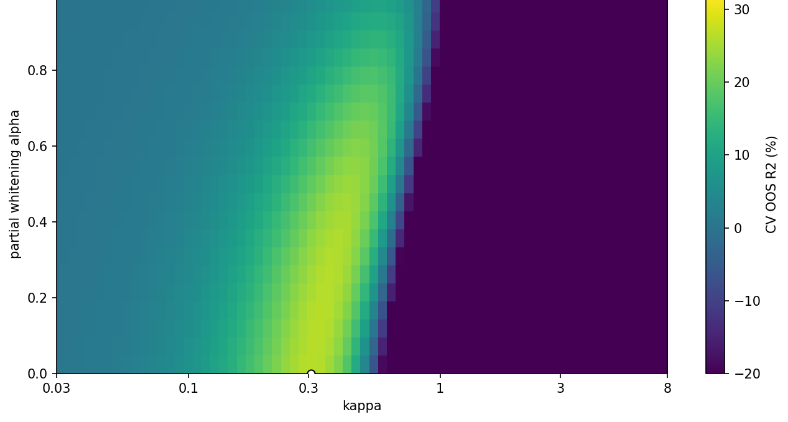
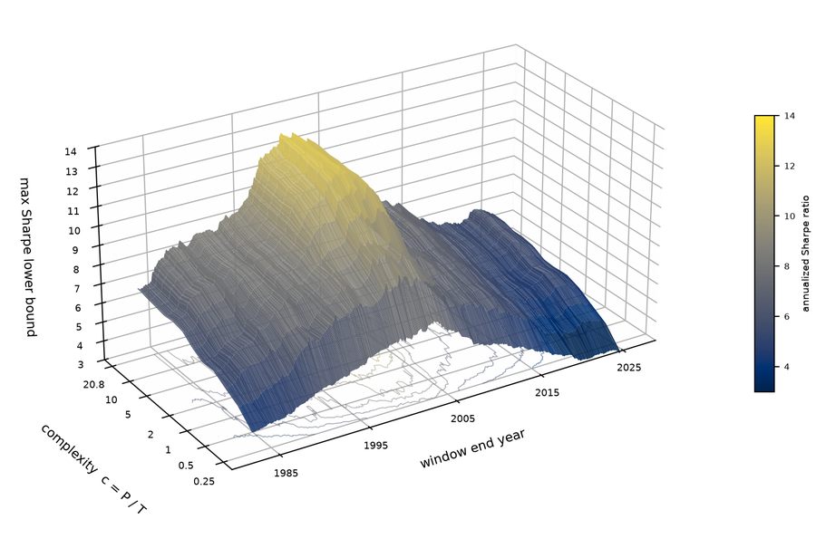
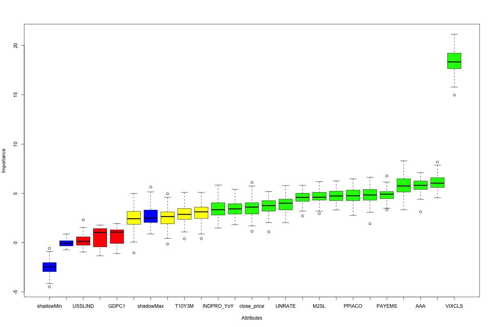

## Research

At UCLA Anderson, I work on empirical asset pricing research with Valentin Haddad and Tyler Muir, focused on high-dimensional stochastic discount factor estimation and how model complexity affects the investment opportunity set. Selected notes below.

::: {.grid}

::: {.g-col-12 .g-col-md-6 .g-col-lg-4}
::: {.card}
::: {.card-header}
## A Variance-Hierarchy Ablation of the KNS Estimator
:::
::: {.card-body}
::: {.card-content}
{fig-align="center"}

::: {.tags-container}
PYTHON
ASSET PRICING
RIDGE REGULARIZATION
:::

::: {.card-description}
Ablation of the Kozak-Nagel-Santosh SDF estimator testing how much its cross-sectional pricing power depends on the covariance eigenvalue hierarchy. A partial-whitening continuum isolates finite-sample regularization from the population Sharpe ratio: whitening leaves the maximal Sharpe ratio invariant, but original-space CV R² collapses from 26.35% to 10.36% as the spectrum flattens, showing the variance hierarchy is load-bearing for the linear ridge estimator.
:::

<button type="button" class="read-more-link" data-modal-target="#modal-kns">Read more</button>
:::

::: {.button-container}
[PDF Notes](KNS_ablation_note.pdf){.btn .btn-dark target="_blank" rel="noopener noreferrer"}
:::
:::
::: {.card-footer}
May 2026
:::
:::
:::

::: {.g-col-12 .g-col-md-6 .g-col-lg-4}
::: {.card}
::: {.card-header .green}
## CKMS Replication and a Complexity Sweep of the Maximal Sharpe Ratio
:::
::: {.card-body}
::: {.card-content}
{fig-align="center"}

::: {.tags-container}
PYTHON
RANDOM FEATURES
RIDGE REGRESSION
:::

::: {.card-description}
Replicates the CKMS bound on the population maximal Sharpe ratio on a rebuilt JKP equity pipeline, then runs a rolling complexity sweep from 121 linear characteristics to 5,000 random nonlinear features across 517 rolling 240-month windows. Finds a single dominant time-varying level (SVD share ≈ 0.98) with a roughly constant multiplicative gain from added model capacity, and a distinct pattern for mega-cap stocks.
:::

<button type="button" class="read-more-link" data-modal-target="#modal-ckms">Read more</button>
:::

::: {.button-container}
[PDF Notes](ckms_notes.pdf){.btn .btn-green target="_blank" rel="noopener noreferrer"}
:::
:::
::: {.card-footer}
September 2026
:::
:::
:::

:::

## Projects

::: {.grid}

::: {.g-col-12 .g-col-md-6 .g-col-lg-4}
::: {.card}
::: {.card-header}
## Yield Curve Forecaster
:::
::: {.card-body}
::: {.card-content}
{fig-align="center"}

::: {.tags-container}
PYTHON
SQL
NSS/AFNS
:::

::: {.card-description}
A quantitative fixed-income analytics toolkit for visualizing, forecasting, and analyzing treasury yields using advanced econometric models. Features Nelson-Siegel-Svensson curve fitting and dynamic term structure analysis.
:::

<button type="button" class="read-more-link" data-modal-target="#modal-yield">Read more</button>
:::

::: {.button-container}
[GitHub](https://github.com/emilblaignan/YieldCurveForecaster){.btn .btn-dark target="_blank" rel="noopener noreferrer"}
:::
:::
::: {.card-footer}
March 20th, 2025
:::
:::
:::

::: {.g-col-12 .g-col-md-6 .g-col-lg-4}
::: {.card}
::: {.card-header .green}
## Macro Drivers of S&P 500
:::
::: {.card-body}
::: {.card-content}
{fig-align="center"}

::: {.tags-container}
R
ECONOMETRICS
BORUTA
:::

::: {.card-description}
A comprehensive econometric analysis identifying key macroeconomic drivers of S&P 500 returns using Boruta feature selection and multiple regression modeling. Explores non-linear relationships and provides robust statistical inference.
:::

<button type="button" class="read-more-link" data-modal-target="#modal-macro">Read more</button>
:::

::: {.button-container}
[GitHub](https://github.com/emilblaignan/Macro-Drivers){.btn .btn-green target="_blank" rel="noopener noreferrer"}
[PDF Report](Report.pdf){.btn .btn-green target="_blank" rel="noopener noreferrer"}
:::
:::
::: {.card-footer}
May 29th, 2025
:::
:::
:::

<!-- You can add more cards here in the same pattern -->

:::

A Variance-Hierarchy Ablation of the KNS Estimator

<button type="button" class="info-box-close" aria-label="Close">&times;</button>

Ablation of the Kozak-Nagel-Santosh SDF estimator testing how much its cross-sectional pricing power depends on the covariance eigenvalue hierarchy. A partial-whitening continuum isolates finite-sample regularization from the population Sharpe ratio: whitening leaves the maximal Sharpe ratio invariant, but original-space CV R² collapses from 26.35% to 10.36% as the spectrum flattens, showing the variance hierarchy is load-bearing for the linear ridge estimator.

CKMS Replication and a Complexity Sweep of the Maximal Sharpe Ratio

<button type="button" class="info-box-close" aria-label="Close">&times;</button>

Replicates the CKMS bound on the population maximal Sharpe ratio on a rebuilt JKP equity pipeline, then runs a rolling complexity sweep from 121 linear characteristics to 5,000 random nonlinear features across 517 rolling 240-month windows. Finds a single dominant time-varying level (SVD share ≈ 0.98) with a roughly constant multiplicative gain from added model capacity, and a distinct pattern for mega-cap stocks.

Yield Curve Forecaster

<button type="button" class="info-box-close" aria-label="Close">&times;</button>

A quantitative fixed-income analytics toolkit for visualizing, forecasting, and analyzing treasury yields using advanced econometric models. Features Nelson-Siegel-Svensson curve fitting and dynamic term structure analysis.

Macro Drivers of S&amp;P 500

<button type="button" class="info-box-close" aria-label="Close">&times;</button>

A comprehensive econometric analysis identifying key macroeconomic drivers of S&amp;P 500 returns using Boruta feature selection and multiple regression modeling. Explores non-linear relationships and provides robust statistical inference.

